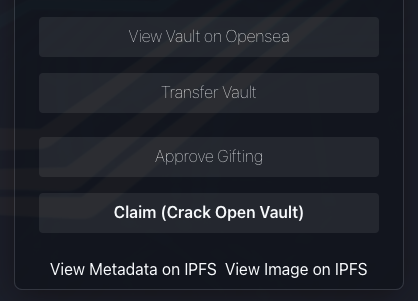
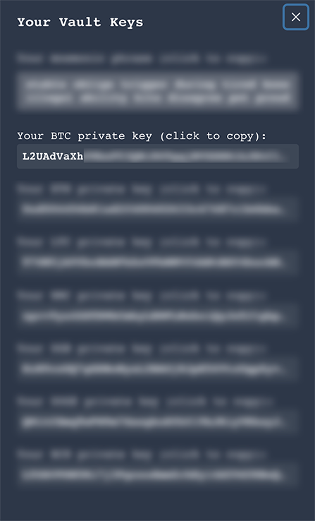

# How to: Crack an Emblem Vault

So, a lot of people are wondering how to crack an emblem vault.
Possible reasons to crack a vault are "I want to be able to send it to another address" or simply "I don't like the image attached to the vault, so I want to create a new vault".

I'll try to explain how this works step by step, using a vaulted Counterparty (XCP) token which I import in [Freewallet](https://freewallet.io) as an example.

The [vault I used](https://emblem.finance/nft?id=523993362435137) in this example contained a Memorychain asset called [WACKNAKAMOTO](https://xchain.io/asset/WACKNAKAMOTO), the 1st card of the Memorychain series (subtle shill here 😉 ). It lived on the Polygon network, but that's not relevant for this "tutorial".

## Steps

1. Go to [Your Emblem vaults](https://emblem.finance/vaults) overview (make sure you're connected with your metamask and you're on the "Unclaimed" tab). Click on the vault you want to crack.

2. If you're really sure you want to crack the vault click on "Claim (Crack Open Vault)"

    

    Metamask will popup and will ask you to confirm the action (it'll cost about 0.01 ETH cause the vault will be sent to the 0x0000 burn address, that way the vault can't be sold on OpenSea anymore). Here's [an ETH example](https://etherscan.io/tx/0xc20fdfb6e43945418af6f6d5d7f3c69bd4ecb4b50c290dffb52c19f797b9e1ab) of the burn/transfer.

3. Once this tx is confirmed, you can click on the "Get Keys" button and when you sign the msg you'll see the vaults seed phrase and all the privkeys of the wallets in the vault (for all networks there's a different privkey).

    

    

4. Copy the BTC private key and go to your freewallet. In the top right, click on the "QR code" and choose "Change Address". In the bottom of the popup click on "Options" and choose "Import Private Key"

    

    Paste the privkey and click "Ok". Scroll down until you see the new "Imported Address #1", select it and click "Ok".

5. The balances of the address should show up. If not click the "refresh" icon. 

    

    Important to not forget is to send some BTC to the address, otherwise you can't send the contents of the cracked vault to another address. You can view the address by clicking on the "QR code" and choose "View Address".

    

6. If the BTC has arrived you can now send the asset to another wallet. Make sure to send the leftover BTC too (would be a waste otherwise) or donate it to [1obiAgwKHdqrv135uzHH81Pz7MGG1sqvw](https://xchain.io/address/1obiAgwKHdqrv135uzHH81Pz7MGG1sqvw) 😜

I hope this "tutorial" helps!

Cheers, [Obi](https://twitter.com/crypt0biwan)